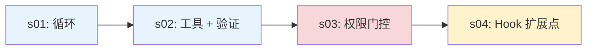

# Hooks 问答

> 本文档整理自学习过程中的 Hooks 相关问题，基于本仓库 `s01_agent_loop`、`s02_tool_use`、`s03_permission`、`s04_hooks` 章节及 Claude Code（CC）源码附录说明。与 [Permission 问答](permission-qa.md)、[Validation 问答](validation-qa.md) 互补：Hooks 管「在固定时机插入什么扩展逻辑」。
>
> **创建日期**：2026-06-26 · **最后更新**：2026-06-26

---

## 目录

- [Q1：为什么需要 Hooks？](#q1为什么需要-hooks)
  - [一句话概括](#一句话概括)
  - [s03 的痛点：循环膨胀](#s03-的痛点循环膨胀)
  - [s04 的解法：固定生命周期事件](#s04-的解法固定生命周期事件)
  - [register_hook / trigger_hooks API](#register_hook--trigger_hooks-api)
  - [四个设计理由](#四个设计理由)
  - [学习路径 s01 → s04](#学习路径-s01--s04)
  - [s03 vs s04 核心变更](#s03-vs-s04-核心变更)
  - [动手试：s04 README 推荐 prompt](#动手试s04-readme-推荐-prompt)
- [Q2：Hooks 和 Permission / Validation 的关系](#q2hooks-和-permission--validation-的关系)
  - [机制 vs 策略层](#机制-vs-策略层)
  - [Hook allow 仍受 settings 约束](#hook-allow-仍受-settings-约束)
  - [管线中的执行顺序](#管线中的执行顺序)
- [Q3：CC 比教学版多什么？](#q3cc-比教学版多什么)
  - [27 个 hook 事件 vs 4 个教学事件](#27-个-hook-事件-vs-4-个教学事件)
  - [HookResult 常用字段](#hookresult-常用字段)
  - [stopHookActive 防无限循环](#stophookactive-防无限循环)
  - [PostToolUse preventContinuation](#posttooluse-preventcontinuation)
  - [教学版刻意简化的部分](#教学版刻意简化的部分)
- [参考链接](#参考链接)

---

## Q1：为什么需要 Hooks？

### 一句话概括

**Hooks（钩子）** 是在 Agent 循环的**固定生命周期节点**上挂载扩展逻辑的机制。它的作用是：**让循环保持稳定核心，把日志、权限、副作用等横切关注点挂在外面**，而不是每加一种行为就改 `agent_loop`。

> *「挂在循环上，不写进循环里」* —— 见 [`s04_hooks/README.md`](../../s04_hooks/README.md) 开篇。

### s03 的痛点：循环膨胀

`s03` 在 `s02` 的 agent loop 里插入了 `check_permission()`，解决了「危险操作无门控」的问题。但每增加一种扩展需求，都要**直接修改循环**：

```python
def agent_loop(messages):
    while True:
        # ... LLM call ...
        for block in response.content:
            if block.type != "tool_use":
                continue
            log_to_file(block)          # 加一行：记录每次 bash 调用
            check_permission(block)     # 加一行：权限检查
            notify_slack(block)         # 加一行：Slack 通知
            output = execute(block)
            auto_git_add(block)         # 加一行：操作后自动 git add
            # ... 很快循环就认不出来了
```

你想扩展的是 Agent 的**行为**，但你改的却是**循环本身**。循环应该是一个稳定的核心，扩展应该挂在外面——这正是 `s04_hooks` 要解决的问题（见 [`s04_hooks/README.md`](../../s04_hooks/README.md)「问题」一节）。

### s04 的解法：固定生命周期事件

`s04` **完全保留** `s03` 的循环和权限逻辑。唯一变动：把 `check_permission()` 从循环体内移到 hook 上，循环不再直接调用任何检查函数，改为 `trigger_hooks("PreToolUse", block)`，由注册表决定跑什么。

四个事件，覆盖一个完整的 agent cycle：

| 事件 | 触发时机 | 典型用途 |
|------|---------|---------|
| `UserPromptSubmit` | 用户输入提交后、进入 LLM 前 | 输入验证、注入上下文 |
| `PreToolUse` | 工具执行前 | 权限检查、日志记录 |
| `PostToolUse` | 工具执行后 | 副作用（自动 git add 等）、输出检查 |
| `Stop` | 循环即将退出时 | 收尾清理（CC 还支持强制续跑） |

```
用户输入
   │
   ▼
UserPromptSubmit ──→ 进入 LLM
   │
   ▼
模型发出 tool_use
   │
   ▼
PreToolUse ──→ 阻止则跳过执行
   │
   ▼
TOOL_HANDLERS 执行
   │
   ▼
PostToolUse ──→ 副作用 / 输出检查
   │
   ▼
stop_reason != "tool_use"?
   │
   ▼
Stop ──→ 可强制续跑
```

### register_hook / trigger_hooks API

扩展通过 `register_hook()` 注册，循环只调用 `trigger_hooks()`：

```python
HOOKS = {
    "UserPromptSubmit": [],
    "PreToolUse": [],
    "PostToolUse": [],
    "Stop": [],
}

def register_hook(event: str, callback):
    HOOKS[event].append(callback)

def trigger_hooks(event: str, *args):
    for callback in HOOKS[event]:
        result = callback(*args)
        if result is not None:   # 返回值 ≠ None → hook 说"停"
            return result
    return None
```

教学版语义：

| 事件 | 非 None 返回值含义 |
|------|-------------------|
| `PreToolUse` | 阻止本次工具执行，返回值作为错误信息 |
| `Stop` | 强制续跑，返回值注入为 user message |
| `UserPromptSubmit` / `PostToolUse` | 返回值未被使用（仅演示日志等） |

### 四个设计理由

**1. 开闭原则（Open-Closed Principle）**

循环对扩展开放（可注册 hook），对修改封闭（不必改 `agent_loop`）。新需求 = 新 callback + `register_hook()`，不动核心循环。

**2. 横切关注点（Cross-Cutting Concerns）**

日志、Slack 通知、自动 git add、上下文注入——这些逻辑**横跨多种工具**，不属于某一个 `TOOL_HANDLERS` 函数。Hooks 提供统一挂载点，避免在循环里散落 `if block.name == "bash": ...`。

**3. 补充 Permission，而非替代**

`s03` 的 `check_permission()` 在 `s04` 被包装成 `permission_hook`，挂在 `PreToolUse` 上。Permission 回答「允许执行吗」，Hooks 回答「在哪个时机插入逻辑」。权限决策可以**通过** PreToolUse hook 实现，但 hook 机制本身更通用——还可以做日志、改输入、注入上下文等。

**4. 产品化 / 插件化**

用户和项目可以通过脚本注册 hook，而不 fork 核心代码。CC 实际有 27 个 hook 事件（教学版讲 4 个核心事件），支撑会话管理、子 Agent、压缩、团队任务等场景——都是同一套「注册 + 触发」模式。

### 学习路径 s01 → s04

| 阶段 | 章节 | 核心收获 |
|------|------|----------|
| `s01` | Agent loop | 理解 while 循环 + tool_use / tool_result 往返 |
| `s02` | Tool use | 5 个工具 + schema / `safe_path` 验证 |
| `s03` | Permission | 执行前要有门控（`check_permission()`） |
| `s04` | Hooks | 门控不应写死在循环里（`trigger_hooks()`） |

演进动机：**先理解「执行前要有门控」（s03），再理解「门控和扩展不应写死在循环里」（s04）**。



### s03 vs s04 核心变更

循环里**只改了一处**：`check_permission(block)` → `trigger_hooks("PreToolUse", block)`。

```python
# s03: 硬编码在循环里
if not check_permission(block):
    results.append({... "content": "Permission denied."})
    continue

# s04: hook 替代硬编码
blocked = trigger_hooks("PreToolUse", block)
if blocked:
    results.append({... "content": str(blocked)})
    continue
```

| 组件 | s03 | s04 |
|------|-----|-----|
| 扩展方式 | `check_permission()` 硬编码在循环里 | `HOOKS` 注册表 + `trigger_hooks()` |
| 新函数 | — | `register_hook`, `trigger_hooks` |
| hook 回调 | — | `context_inject_hook`, `permission_hook`, `log_hook`, `large_output_hook`, `summary_hook` |
| 循环 | 直接调用 `check_permission()` | 调用 `trigger_hooks("PreToolUse", ...)` |
| 退出控制 | 无 | `trigger_hooks("Stop", ...)` 可阻止退出 |
| 输入拦截 | 无 | `trigger_hooks("UserPromptSubmit", ...)` 可注入上下文 |

`s03` 的权限逻辑**原封不动**，只是从循环内函数调用变成了 PreToolUse hook 注册——这是理解「Hooks 补充 Permission」的最佳示例。

### 动手试：s04 README 推荐 prompt

```sh
cd learn-claude-code
python s04_hooks/code.py
```

| # | Prompt | 预期行为 |
|---|--------|----------|
| 1 | `Read the file README.md` | 直接通过，观察 PreToolUse `[HOOK]` 日志 |
| 2 | `Create a file called test.txt` | 通过后观察 PostToolUse 是否触发 |
| 3 | `Delete all temporary files in /tmp` | bash + rm 触发 `permission_hook` 拦截 |

观察重点：每次工具执行前是否出现 `[HOOK]` 日志？权限被拒时，是 hook 拦截的还是循环里硬编码的？（答案：s04 里全是 hook 拦截，循环本身不再含权限逻辑。）

---

## Q2：Hooks 和 Permission / Validation 的关系

### 机制 vs 策略层

三者都出现在工具执行链路中，但层级不同（详见 [Validation 问答 Q2](validation-qa.md#q2validationpermissionhooks-有什么区别为什么要单独抽象)、[Permission 问答 Q1](permission-qa.md#q1s03-permission-有什么可以讲的有什么重点)）：

| 维度 | Validation | Permission | Hooks |
|------|------------|------------|-------|
| **本质** | 验证层（参数合法吗） | 策略层（操作允许吗） | **机制层**（在固定时机插入逻辑） |
| **核心问题** | 这次调用的参数**合法吗**？ | 这次操作**允许执行吗**？ | 想在哪个节点**挂载什么回调**？ |
| **教学章节** | `s02` | `s03` | `s04` |
| **典型实现** | Schema、`safe_path()` | 三道闸门、`check_permission()` | `register_hook` + `trigger_hooks` |

**Hooks 是机制，Permission 是常通过 PreToolUse 实现的策略之一。** 教学版把 `check_permission()` 包装成 `permission_hook`；CC 中 PreToolUse hook 还可返回 `permissionBehavior`（allow/deny/ask/passthrough），但仍需经过 Permission 内层链最终裁决。

### Hook allow 仍受 settings 约束

这是 CC 权限系统最重要的安全设计（`s04` 附录、`toolHooks.ts:325-331`）：

> **Hook 返回 `allow` 时，仍然要检查 settings.json 的 deny/ask 规则。** 即使用户的 hook 脚本说「允许」，如果在 settings 中禁用了这个工具，操作仍然会被阻止。

教学版没有这个层次——PreToolUse 的非 None 返回值直接解释为阻止执行。这在教学场景中够了，但在生产环境中若 hook allow 能绕过 settings，会形成安全漏洞。详见 [Permission 问答 Q2](permission-qa.md#hooks-与-resolvehookpermissiondecision)。

### 管线中的执行顺序

在 CC 生产管线中，顺序固定（`toolExecution.ts` 的 `checkPermissionsAndCallTool()`）：

```
模型发出 tool_use
       │
       ▼
┌──────────────────────────────────────────────────────────┐
│  1. Zod schema 验证          ← Validation               │
├──────────────────────────────────────────────────────────┤
│  2. validateInput()          ← Validation               │
├──────────────────────────────────────────────────────────┤
│  3. backfillObservableInput()                           │
├──────────────────────────────────────────────────────────┤
│  4. PreToolUse hooks         ← Hooks 层                 │
├──────────────────────────────────────────────────────────┤
│  5. resolveHookPermissionDecision()                     │
├──────────────────────────────────────────────────────────┤
│  6. hasPermissionsToUseToolInner()  ← Permission 内层链  │
├──────────────────────────────────────────────────────────┤
│  7. tool.call()              ← 执行                     │
└──────────────────────────────────────────────────────────┘
       │
       ▼
   PostToolUse hooks            ← Hooks 层（执行后）
```

要点：

- **Validation 先于 PreToolUse hooks** — 参数不合法时，hook 不会被调用
- **PreToolUse hooks 先于 Permission 内层链** — hook 可建议 `permissionBehavior`，但最终由 `hasPermissionsToUseToolInner()` 裁决
- **Hooks 不替代 Validation 或 Permission** — 它们是管线中不同阶段的独立职责

教学版简化对应：

```
Schema / safe_path  →  trigger_hooks("PreToolUse")  →  permission_hook  →  TOOL_HANDLERS
     Validation                    Hooks                      Permission
```

---

## Q3：CC 比教学版多什么？

以下内容来自 [`s04_hooks/README.md`](../../s04_hooks/README.md) 附录「深入 CC 源码」。

### 27 个 hook 事件 vs 4 个教学事件

教学版只讲 4 个核心事件，因为它们覆盖了一个完整 agent cycle 的关键节点。CC 实际有 **27 个** hook 事件（`coreTypes.ts:25-53`）：

| 类别 | 事件 |
|------|------|
| 工具相关 | `PreToolUse`, `PostToolUse`, `PostToolUseFailure` |
| 会话相关 | `SessionStart`, `SessionEnd`, `Stop`, `StopFailure`, `Setup` |
| 用户交互 | `UserPromptSubmit`, `Notification`, `PermissionRequest`, `PermissionDenied` |
| 子 Agent | `SubagentStart`, `SubagentStop` |
| 压缩相关 | `PreCompact`, `PostCompact` |
| 团队相关 | `TeammateIdle`, `TaskCreated`, `TaskCompleted` |
| 其他 | `Elicitation`, `ElicitationResult`, `ConfigChange`, `WorktreeCreate`, `WorktreeRemove`, `InstructionsLoaded`, `CwdChanged`, `FileChanged` |

其他 23 个事件与教学版 4 个事件**同一模式**：注册回调 → 在固定时机触发 → 根据 `HookResult` 决定后续行为。

### HookResult 常用字段

CC 的 `HookResult`（`types/hooks.ts:260-275`）有 14 个字段。教学版简化为「None = 继续，非 None = 阻止/续跑」：

| 字段 | 类型 | 用途 |
|------|------|------|
| `message` | Message | 可选 UI 消息 |
| `blockingError` | HookBlockingError | 阻塞错误 → 注入对话让模型自纠 |
| `outcome` | success/blocking/non_blocking_error/cancelled | 执行结果 |
| `preventContinuation` | boolean | 阻止后续执行 |
| `stopReason` | string | 停止原因描述 |
| `permissionBehavior` | allow/deny/ask/passthrough | hook 返回权限决策 |
| `updatedInput` | Record | 修改工具输入 |
| `additionalContext` | string | 附加上下文 |
| `updatedMCPToolOutput` | unknown | MCP 工具输出修改 |

教学版 PreToolUse 只能「阻止或放行」；CC 还可以**改输入**、**附加上下文**、**返回结构化权限决策**，粒度远更细。

### stopHookActive 防无限循环

CC 的 Stop hooks 有防无限循环机制（`query.ts:212,1300`）：`stopHookActive` 状态字段。

当 stop hooks 产生 `blockingError` 时，循环带 `stopHookActive: true` 重入下一轮。后续迭代中 stop hooks 看到这个标志就**不会再次触发**。

这防止了一个永不停机的 bug：

```
模型自纠 → stop hook 再次报错 → 模型再自纠 → stop hook 再报错 → ...
```

教学版 Stop hook 只做简单续跑，不涉及此机制。

### PostToolUse preventContinuation

PostToolUse hooks 返回 `preventContinuation: true` 时（`toolHooks.ts:117-130`）：

1. 产生一个 `hook_stopped_continuation` 附件
2. `query.ts`（L1388-1393）检测到后设置 `shouldPreventContinuation = true`
3. 循环**优雅退出**——不是崩溃，是 hook 主动让 Agent 完成

这与教学版 Stop hook 的「强制续跑」形成对照：CC 在**执行后**和**退出时**都有精细的 continuation 控制。

### 教学版刻意简化的部分

| CC 能力 | 教学版简化 |
|---------|-----------|
| 27 个事件 | 4 个（UserPromptSubmit / PreToolUse / PostToolUse / Stop） |
| 14 个 HookResult 字段 | None = 继续，非 None = 阻止/续跑 |
| Hook allow vs deny/ask 不变式 | 省略（无 settings.json 层） |
| `stopHookActive` | 省略 |
| `preventContinuation` | 省略 |

这些简化是**刻意的**——先建立「挂在循环上，不写进循环里」的心智模型，再读 CC 附录理解生产复杂度。

---

## 参考链接

| 主题 | 仓库路径 |
|------|----------|
| Hook 事件、扩展点、CC 附录 | [`s04_hooks/README.md`](../../s04_hooks/README.md) |
| 权限三道闸门与 s03→s04 演进 | [`s03_permission/README.md`](../../s03_permission/README.md) |
| Permission 问答（Yolo、责任链、Hook allow 不变式） | [`permission-qa.md`](permission-qa.md) |
| Validation 问答（验证管线、三层分工） | [`validation-qa.md`](validation-qa.md) |
| 工具分发与验证管线（附录） | [`s02_tool_use/README.md`](../../s02_tool_use/README.md) |
| Agent loop 基础 | [`s01_agent_loop/README.md`](../../s01_agent_loop/README.md) |
| 教学版 s03 可运行代码 | [`s03_permission/code.py`](../../s03_permission/code.py) |
| 教学版 s04 可运行代码 | [`s04_hooks/code.py`](../../s04_hooks/code.py) |

**CC 源码参考**（附录中引用，本仓库不含 CC 源码）：

- `toolHooks.ts` — Pre-chat PreToolUse / PostToolUse 钩子处理、`hook_stopped_continuation`
- `hooks.ts` — hook 注册与触发基础设施
- `stopHooks.ts` — Stop hook 专用逻辑
- `coreTypes.ts` — 27 个 hook 事件定义
- `types/hooks.ts` — `HookResult` 类型
- `query.ts` — `stopHookActive`、`shouldPreventContinuation`
- `toolExecution.ts` — PreToolUse hooks 在验证管线中的位置

---

*文档版本：2026-06-26*
