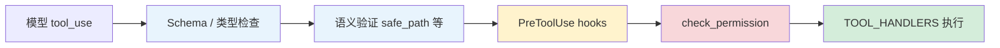

# Validation Pipeline 问答

> 本文档整理自学习过程中的验证与流式执行相关问题，基于本仓库 `s01_agent_loop`、`s02_tool_use`、`s03_permission`、`s04_hooks` 章节及 Claude Code（CC）源码附录说明。
>
> **创建日期**：2026-06-26 · **最后更新**：2026-06-26（新增 Q3–Q5：Streaming 与 Validation 关系）

---

## 目录

- [Q1：Validation Pipeline 是什么？有什么用？解决了什么问题？](#q1validation-pipeline-是什么有什么用解决了什么问题)
  - [一句话概括](#一句话概括)
  - [五步验证管线](#五步验证管线)
  - [各步骤解决的问题](#各步骤解决的问题)
  - [与教学版的对应关系](#与教学版的对应关系)
- [Q2：Validation、Permission、Hooks 有什么区别？为什么要单独抽象？](#q2validationpermissionhooks-有什么区别为什么要单独抽象)
  - [三层职责对比](#三层职责对比)
  - [执行顺序与依赖关系](#执行顺序与依赖关系)
  - [为什么要分开抽象](#为什么要分开抽象)
- [Q3：Streaming Tool Execution 是什么意思？](#q3streaming-tool-execution-是什么意思)
  - [一句话概括](#一句话概括-1)
  - [CC 与教学版的差异](#cc-与教学版的差异)
  - [带来的好处](#带来的好处)
  - [常见误解](#常见误解)
- [Q4：CC 真实的是有 Streaming 层的 validation 吗？](#q4cc-真实的是有-streaming-层的-validation-吗)
  - [Streaming 与 Validation 各管什么](#streaming-与-validation-各管什么)
  - [needsFollowUp 不是验证](#needsfollowup-不是验证)
- [Q5：不管是不是 streaming，都会走 validation 吗？](#q5不管是不是-streaming都会走-validation-吗)
  - [对比总览](#对比总览)
  - [流程示意](#流程示意)
- [综合示例：`bash rm` 命令的完整旅程](#综合示例bash-rm-命令的完整旅程)
- [参考链接](#参考链接)

---

## Q1：Validation Pipeline 是什么？有什么用？解决了什么问题？

### 一句话概括

**Validation Pipeline（验证管线）** 是 CC 在真正执行工具之前，对每一次工具调用依次经过的多道检查流程。它的作用是：**在工具跑起来之前，把「参数不合法」「语义不安全」「用户未授权」等问题拦下来**，避免无效调用、越权操作和难以调试的运行时错误。

### 五步验证管线

在 CC 源码 `toolExecution.ts` 的 `checkPermissionsAndCallTool()` 中，每个工具调用按固定顺序经过以下 5 步（教学版在 `s02_tool_use/README.md` 附录「四、验证管线」中有对应说明）：

```
模型发出 tool_use
       │
       ▼
┌──────────────────────────────────────────────────────────┐
│  1. Zod schema 验证          参数类型 / 结构是否合法      │
├──────────────────────────────────────────────────────────┤
│  2. validateInput()          工具级语义验证（如路径范围） │
├──────────────────────────────────────────────────────────┤
│  3. PreToolUse hooks         钩子可改输入、附加消息、阻止 │
├──────────────────────────────────────────────────────────┤
│  4. 权限检查                 allow / deny / ask           │
├──────────────────────────────────────────────────────────┤
│  5. tool.call()              真正执行工具                 │
└──────────────────────────────────────────────────────────┘
       │
       ▼
   返回 tool_result
```

| 步骤 | CC 源码位置 | 职责 | 典型失败场景 |
|------|-------------|------|--------------|
| 1. Schema 验证 | `toolExecution.ts:614-680` | 检查参数类型、必填字段、结构是否符合工具定义 | 把字符串传给需要数字的字段 |
| 2. `validateInput()` | `toolExecution.ts:682-733` | 工具自己的语义校验 | 文件路径超出工作区、`old_text` 在文件中不存在 |
| 3. PreToolUse hooks | `toolExecution.ts:800-862` | 用户/项目自定义的前置逻辑 | 记录日志、注入上下文、修改输入、返回阻止 |
| 4. 权限检查 | `toolExecution.ts:921-931` | `canUseTool` + `checkPermissions` → allow/deny/ask | `rm -rf /` 硬拒绝、删文件需用户确认 |
| 5. 执行 | `toolExecution.ts:1207-1222` | 调用 `tool.call()` 产生实际副作用 | —（只有通过前四步才会到达） |

> **注意**：步骤 1–2 属于狭义的 **Validation（验证）**；步骤 3–4 是 **Hooks** 与 **Permission** 层，但它们在 CC 里被编排进同一条「工具执行前管线」，因此整体常被称为 Validation Pipeline。

### 各步骤解决的问题

| 问题类别 | 没有验证管线时 | 对应步骤 |
|----------|----------------|----------|
| **参数格式错误** | 工具函数在运行时才抛异常，错误信息难懂 | 步骤 1：Schema 验证 |
| **参数语义非法** | 如读写工作区外路径，副作用已发生才报错 | 步骤 2：`validateInput()` |
| **扩展逻辑侵入循环** | 每加一种检查就改 `agent_loop` | 步骤 3：PreToolUse hooks |
| **危险操作无门控** | 模型可执行 `rm -rf /` 等破坏性命令 | 步骤 4：权限检查 |
| **无效调用浪费资源** | 坏参数也触发 shell / 文件 I/O | 步骤 1–2 提前短路 |

教学版（`s02`）的简化策略：

- 用 **JSON Schema** 替代 Zod（步骤 1）
- 用 **`safe_path()`** 等安全函数替代独立的 `validateInput()`（步骤 2）
- **保留** 权限检查（`s03`）和钩子概念（`s04`）

### 与教学版的对应关系



- 蓝色：Validation 层（格式 + 语义）
- 黄色：Hooks 层（扩展点）
- 红色：Permission 层（授权门控）
- 绿色：实际执行

---

## Q2：Validation、Permission、Hooks 有什么区别？为什么要单独抽象？

### 三层职责对比

三者都出现在「工具真正执行之前」，但**回答的问题不同**：

| 维度 | Validation（验证） | Permission（权限） | Hooks（钩子） |
|------|-------------------|-------------------|---------------|
| **核心问题** | 这次调用的参数**合法吗**？ | 这次操作**允许执行吗**？ | 想在固定时机**插入什么扩展逻辑**？ |
| **判断依据** | Schema、工具定义、业务规则 | 拒绝列表、规则匹配、用户审批、settings 策略 | 用户注册的回调函数 |
| **典型结果** | 验证失败 → 返回错误，不执行 | `allow` / `deny` / `ask` / `passthrough` | 改输入、附加上下文、阻止、记录日志 |
| **谁定义** | 工具作者（每个 tool 自带） | 系统 + 用户配置（8 个规则来源） | 用户 / 项目脚本（`register_hook`） |
| **教学章节** | `s02`（`safe_path`、schema） | `s03`（三道闸门） | `s04`（四个事件） |
| **CC 源码** | `toolExecution.ts` 614–733 | `permissions.ts`、`toolExecution.ts` 921–931 | `toolHooks.ts`、`toolExecution.ts` 800–862 |

**Validation** 关心的是「这次调用在技术上是否成立」——参数对不对、路径在不在范围内。

**Permission** 关心的是「这次操作在策略上是否被允许」——即使用户 hook 说 allow，settings 里的 deny 规则仍可覆盖（CC 重要安全不变式，见 `s04` 附录）。

**Hooks** 关心的是「在不改核心循环的前提下，如何挂载横切逻辑」——日志、自动 git add、上下文注入等。

### 执行顺序与依赖关系

在 CC 生产管线中，顺序是固定的（`s03` 附录「二、生产版的验证阶段」）：

```
1. Zod schema 验证
2. validateInput()
3. backfillObservableInput()     ← 补全遗留字段
4. PreToolUse hooks              ← Hooks 层（可返回 permissionBehavior）
5. resolveHookPermissionDecision()
6. hasPermissionsToUseToolInner()  ← Permission 层（多层规则）
7. tool.call()                   ← 执行
```

教学版演进路径体现了分层动机：

| 阶段 | 做法 | 痛点 |
|------|------|------|
| `s02` | 直接 `TOOL_HANDLERS[name](**input)` | bash 无限制，危险命令可执行 |
| `s03` | 循环内插入 `check_permission()` | 每加一种检查就改循环 |
| `s04` | `trigger_hooks("PreToolUse", block)` | 循环稳定，扩展挂在外面 |

### 为什么要分开抽象

**1. 单一职责（Separation of Concerns）**

如果把 schema 检查、路径校验、用户审批、日志记录全写进一个函数，任何小改动都会牵动整条链路。分开后：

- 工具作者只维护 `validateInput()`
- 安全策略集中在 Permission 模块
- 用户自定义逻辑通过 Hooks 注册，不碰核心循环

**2. 失败模式不同，处理方式不同**

| 层 | 失败时 | 是否可询问用户 |
|----|--------|----------------|
| Validation | 直接返回结构化错误给模型 | 否（参数错了，问用户也没用） |
| Permission | deny 直接拒绝；ask 弹窗等待 | 是（策略性决策） |
| Hooks | 可阻止、可改输入、可仅记录 | 视 hook 实现而定 |

**3. 可组合、可扩展**

- Validation 是**每个工具自带的契约**，新工具必须实现
- Permission 是**全局策略引擎**，规则来自 settings、CLI、会话等多来源
- Hooks 是**事件驱动的插件点**，CC 实际有 27 个事件（教学版讲 4 个核心事件）

**4. 安全边界清晰**

CC 明确规定：**Hook 返回 `allow` 不能绕过 deny/ask 规则**（`toolHooks.ts:325-331`）。这只有在 Permission 独立成层时才能 enforce——否则 hook 和权限混在一起，容易出现「脚本说行就行」的漏洞。

---

## Q3：Streaming Tool Execution 是什么意思？

### 一句话概括

**Streaming Tool Execution（流式工具执行）** 是 CC 的一种**编排/时序优化**：在模型还在流式输出回复时，一旦检测到完整的 `tool_use` 块，就立刻调度执行工具，而不是等整段响应结束后再统一跑工具。

出处：`s02_tool_use/README.md` 附录「五、流式工具执行」。

### CC 与教学版的差异

| 维度 | CC 生产版 | 教学版（`s02` / `s01`） |
|------|-----------|-------------------------|
| **触发时机** | 流式接收中，每个 `tool_use` 块就绪即 dispatch | 等 API 返回**完整** `response` 后，再遍历 `tool_use` 块 |
| **实现入口** | `StreamingToolExecutor`（`StreamingToolExecutor.ts`；`query.ts:561` 调用） | `agent_loop` 中 `for block in response.content` |
| **并发策略** | 结合 `isConcurrencySafe()` 与 `partitionToolCalls()` 分批并发/串行 | 按原始顺序逐个执行 |
| **设计目标** | 降低端到端延迟，与模型生成并行做 I/O | 概念清晰，不追求性能极致 |

典型场景：模型一边输出「我来分析一下这个文件……」，一边已经发出 `read_file` 的 `tool_use`；CC 会立刻启动 `read_file`，文件可能在模型文字还没打完时就读完了。

教学版等价逻辑（简化）：

```python
# 教学版：等整段 response 结束
response = client.messages.create(...)
for block in response.content:
    if block.type == "tool_use":
        output = TOOL_HANDLERS[block.name](**block.input)  # 此时模型早已生成完毕
```

CC 流式路径（概念示意）：

```typescript
// 流式回调中：tool_use 块一完整就 dispatch
onContentBlock(toolUseBlock) {
  streamingToolExecutor.enqueue(toolUseBlock)  // 不等 message 结束
}
```

### 带来的好处

| 收益 | 说明 |
|------|------|
| **更低延迟** | 工具 I/O 与模型后续 token 生成重叠，用户感知等待更短 |
| **并行 I/O** | 多个 concurrency-safe 的读操作可与模型输出同时进行 |
| **更快进入下一轮** | 工具结果更早就绪，agent loop 可更早继续 |

### 常见误解

> **Streaming Tool Execution ≠ 跳过 Validation。**

流式只改变「**何时**把 `tool_use` 交给执行管线」，不改变「**执行前走哪几步检查**」。每个被 dispatch 的工具调用，仍然进入 Q1 所述的 5 步验证管线（`checkPermissionsAndCallTool()`）。

---

## Q4：CC 真实的是有 Streaming 层的 validation 吗？

### Streaming 与 Validation 各管什么

**结论：CC 没有单独的「Streaming validation 层」。**

Streaming 和 Validation 是两条正交的职责：

| 概念 | 回答的问题 | 所在层次 | 典型代码 |
|------|-----------|----------|----------|
| **Streaming（流式编排）** | **什么时候**发现 `tool_use`、**什么时候** dispatch 工具？ | Agent loop / query 编排层 | `StreamingToolExecutor`、`query.ts` 流式回调 |
| **Validation Pipeline** | 这次工具调用**能不能、该不该**执行？ | 工具执行前管线 | `toolExecution.ts` → `checkPermissionsAndCallTool()` |

可以把关系理解为：

```
Streaming 层：  「tool_use 块到了 → 现在 dispatch」
                      │
                      ▼
Validation 层：  对每个 dispatch 的调用，固定走 5 步（schema → validateInput → hooks → permission → call）
```

无论工具是「流式中途 dispatch」还是「整段响应结束后 dispatch」，进入 `checkPermissionsAndCallTool()` 之后的路径**完全相同**——Validation 层不做 streaming / non-streaming 区分。

### needsFollowUp 不是验证

`s01` 附录提到：CC 在流式响应中**不单独依赖 `stop_reason === 'tool_use'`** 来决定是否继续循环，而是用 `needsFollowUp` 标志（`query.ts:830-834`）——流式收到 `tool_use` 块时设为 `true`。

```typescript
// query.ts:554-558（概念摘录）
// stop_reason === 'tool_use' is unreliable.
// Set during streaming whenever a tool_use block arrives.
let needsFollowUp = false
```

| 机制 | 职责 | 是否属于 Validation |
|------|------|---------------------|
| `needsFollowUp` | **循环控制**：本回合结束后是否还要再调模型 | ❌ 否 |
| `checkPermissionsAndCallTool()` | **执行前检查**：参数、语义、钩子、权限 | ✅ 是 |

`needsFollowUp` 解决的是「流式场景下 `stop_reason` 可能滞后」的**编排可靠性**问题，与参数是否合法、操作是否被允许无关。

---

## Q5：不管是不是 streaming，都会走 validation 吗？

**是的，你的理解正确。**

Streaming 与 non-streaming 的唯一实质差异在 **dispatch 时机**（何时把 `tool_use` 交给执行管线）；一旦进入执行管线，Validation / Permission / Hooks 的检查顺序与逻辑一致，**validation 层不做区分**。

### 对比总览

| 阶段 | Non-streaming（教学版） | Streaming（CC） | Validation 是否相同 |
|------|------------------------|-----------------|---------------------|
| 模型生成 | 等完整 `response` | 边收 token 边解析 content block | —（与验证无关） |
| 发现 `tool_use` | `response.content` 遍历 | 流式回调中块就绪即发现 | —（与验证无关） |
| **Dispatch 时机** | 响应结束后批量 dispatch | 块就绪即 dispatch | **此处不同** |
| Schema 验证 | ✅ | ✅ | 相同 |
| `validateInput()` | ✅ | ✅ | 相同 |
| PreToolUse hooks | ✅ | ✅ | 相同 |
| 权限检查 | ✅ | ✅ | 相同 |
| `tool.call()` | ✅ | ✅ | 相同 |

### 流程示意

```
                    ┌─────────────────────────────────────┐
                    │         模型 API（流式 / 非流式）      │
                    └─────────────────┬───────────────────┘
                                      │
              ┌───────────────────────┴───────────────────────┐
              │                                               │
              ▼                                               ▼
   ┌──────────────────────┐                    ┌──────────────────────────┐
   │ Non-streaming         │                    │ Streaming                 │
   │ 等完整 response        │                    │ tool_use 块就绪即 dispatch │
   └──────────┬───────────┘                    └────────────┬─────────────┘
              │                                               │
              └───────────────────────┬───────────────────────┘
                                      ▼
                    ┌─────────────────────────────────────┐
                    │  checkPermissionsAndCallTool()       │
                    │  （相同的 5 步验证管线，无分支）        │
                    │  1. Schema → 2. validateInput →      │
                    │  3. PreToolUse → 4. Permission →     │
                    │  5. tool.call()                      │
                    └─────────────────┬───────────────────┘
                                      ▼
                              返回 tool_result
```

**记忆口诀**：Streaming 管「早不早跑」，Validation 管「能不能跑」——两条线，后者对两种方式一视同仁。

---

## 综合示例：`bash rm` 命令的完整旅程

假设模型发出：

```json
{
  "type": "tool_use",
  "name": "bash",
  "input": { "command": "rm test.txt" }
}
```

以下按 CC 管线（兼对照教学版 `s03`/`s04`）逐步说明：

### 步骤 1–2：Validation

| 检查 | `rm test.txt` 的结果 |
|------|---------------------|
| Schema：`command` 是否为字符串 | ✅ 通过 |
| `validateInput()` / Bash 工具语义检查 | ✅ 命令格式合法 |

若改为 `rm -rf /`：

- Schema 仍 ✅（字符串合法）
- 部分工具可能在 `validateInput()` 做额外检查，但主要拦截在下一步 Permission

### 步骤 3：PreToolUse Hooks（`s04`）

注册的 hook 按顺序执行，例如：

```python
# 日志 hook — 只记录，不阻止
def log_hook(block):
    print(f"[HOOK] {block.name}(...)")
    return None

# 权限 hook — 可能阻止（教学版把 s03 逻辑移到这里）
def permission_hook(block):
    if "rm " in block.input.get("command", ""):
        choice = input("Allow? [y/N] ")
        if choice not in ("y", "yes"):
            return "Permission denied by user"
    return None
```

Hook 可以：

- 返回 `None` → 继续
- 返回非 `None` → 阻止执行（教学版）
- 返回 `permissionBehavior: allow/deny/ask`（CC 生产版）

### 步骤 4：Permission（`s03`）

教学版三道闸门：

| 闸门 | `rm test.txt` | `rm -rf /` |
|------|---------------|------------|
| 1. 硬拒绝列表 | 未命中 | ⛔ 命中 `rm -rf /`，直接拒绝 |
| 2. 规则匹配（含 `rm ` 关键字） | ⚠️ 命中「潜在破坏性命令」 | （已在闸门 1 拒绝） |
| 3. 用户审批 | 等待用户 y/N | — |

CC 生产版更复杂：`PermissionResult` 有 4 种 behavior（`allow` / `deny` / `ask` / `passthrough`），规则来自 8 个配置来源，还支持 YoloClassifier 自动审批。

### 步骤 5：执行

仅当 Validation 通过、Hooks 未阻止、Permission 为 `allow`（或用户确认）后，才调用：

```python
output = TOOL_HANDLERS["bash"](command="rm test.txt")
```

执行后，`PostToolUse` hook 可触发副作用（如大输出提醒、自动 `git add`）。

### 流程总览

```
bash: rm test.txt
        │
        ├─ [Validation]  schema ✅  validateInput ✅
        │
        ├─ [Hooks]       log_hook → 打印日志
        │                permission_hook → 检测到 "rm " → 询问用户
        │
        ├─ [Permission]  闸门2 命中 → 闸门3 用户选 y → allow
        │
        └─ [Execute]     run_bash() → 文件被删除
                           PostToolUse hook → 可选后续处理
```

---

## 参考链接

| 主题 | 仓库路径 |
|------|----------|
| Agent loop 与 `needsFollowUp`（附录） | [`s01_agent_loop/README.md`](../../s01_agent_loop/README.md) |
| 工具分发与验证管线（附录） | [`s02_tool_use/README.md`](../../s02_tool_use/README.md) |
| 流式工具执行（s02 附录「五」） | [`s02_tool_use/README.md#五流式工具执行`](../../s02_tool_use/README.md) |
| 权限三道闸门与 CC 权限阶段 | [`s03_permission/README.md`](../../s03_permission/README.md) |
| Hook 事件与扩展点 | [`s04_hooks/README.md`](../../s04_hooks/README.md) |
| 教学版 s02 可运行代码 | [`s02_tool_use/code.py`](../../s02_tool_use/code.py) |
| 教学版 s03 可运行代码 | [`s03_permission/code.py`](../../s03_permission/code.py) |
| 教学版 s04 可运行代码 | [`s04_hooks/code.py`](../../s04_hooks/code.py) |

**CC 源码参考**（附录中引用，本仓库不含 CC 源码）：

- `toolExecution.ts` — 验证管线主编排（`checkPermissionsAndCallTool`）
- `StreamingToolExecutor.ts` — 流式 dispatch 编排（不替代验证）
- `query.ts` — 流式循环、`needsFollowUp`、调用 `StreamingToolExecutor`
- `utils/permissions/permissions.ts` — `hasPermissionsToUseToolInner()`
- `toolHooks.ts` — PreToolUse / PostToolUse 钩子处理

---

*文档版本：2026-06-26（最后更新：新增 Q3–Q5 Streaming 与 Validation 关系）*
